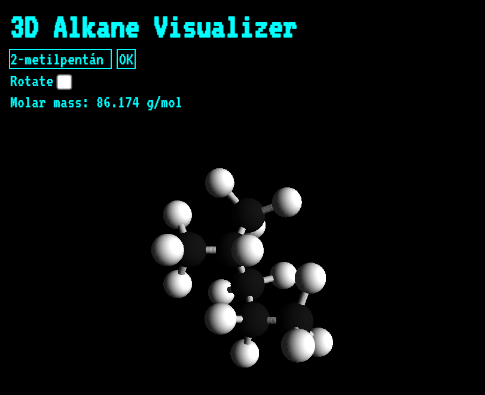

# 3D Molecule Structure Visualizer
This program asks for the alkane's IUPAC name and automatically generates the 3D structure of it.
The program accepts only Hungarian IUPAC names currently.

- methane, ethane, propane -> metán, etán, propán
- 2,3-dimetilheptán means that there is a heptane molecule and two methyl groups are connected to the 2nd and 3rd coal atom respectively.

The program is available online at https://johetajava.hu/kemia/en/

# 3D Molekula szerkezet vizualizáció

Ez a program bekéri az alkán nevét, majd legenerál belőle egy 3D modellt. Példák:
- metán, etán, propán, ...
- 2,3-dimetilheptán
- 3-metil-4-etildekán
- 2-fluor-pentán

A program megtekinthető a https://johetajava.hu/kemia/ oldalon.
 
